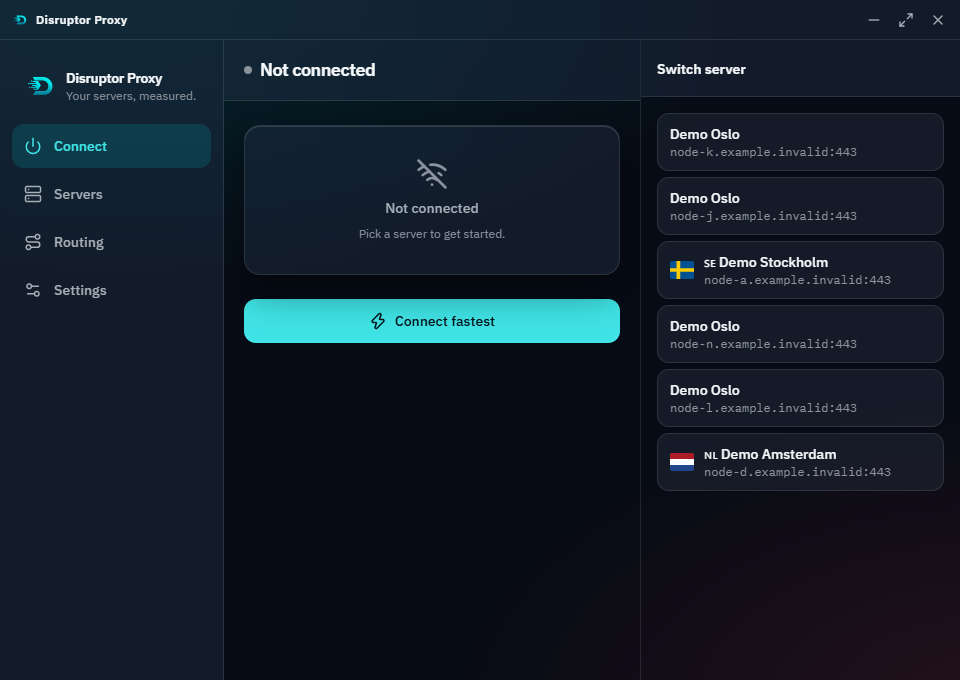
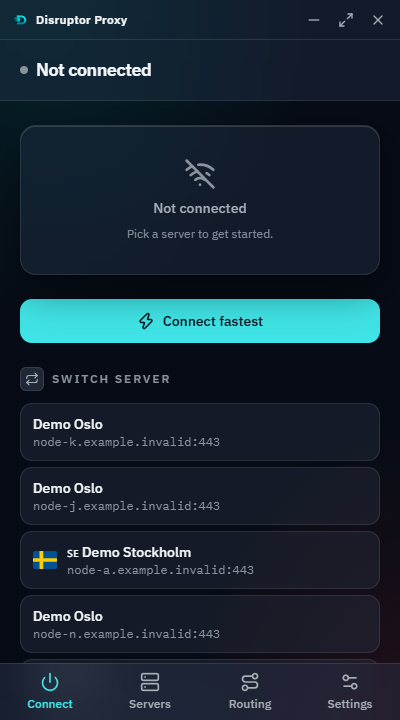
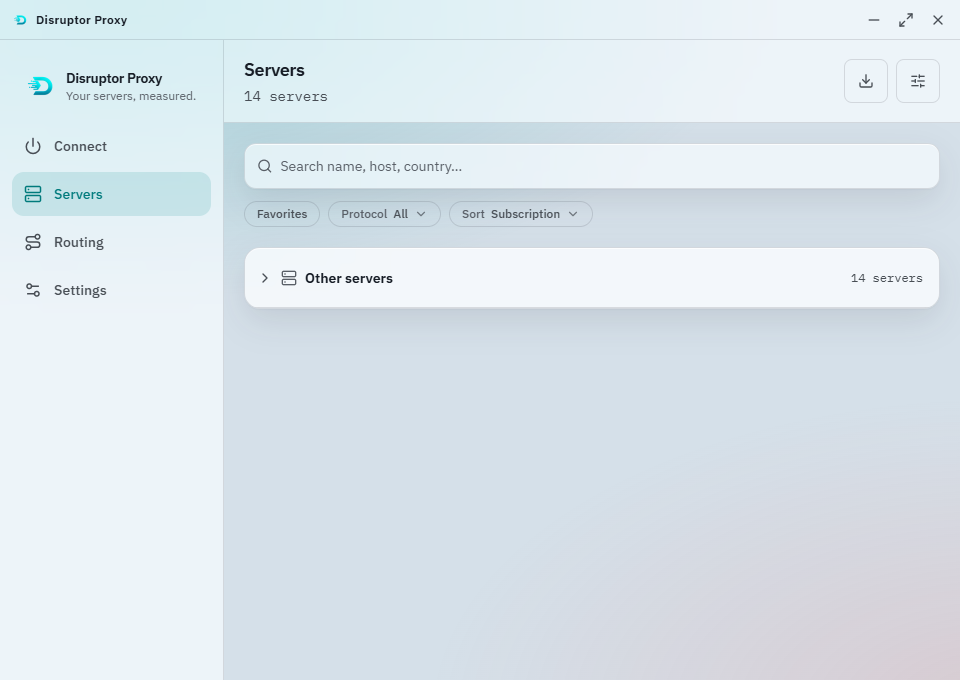
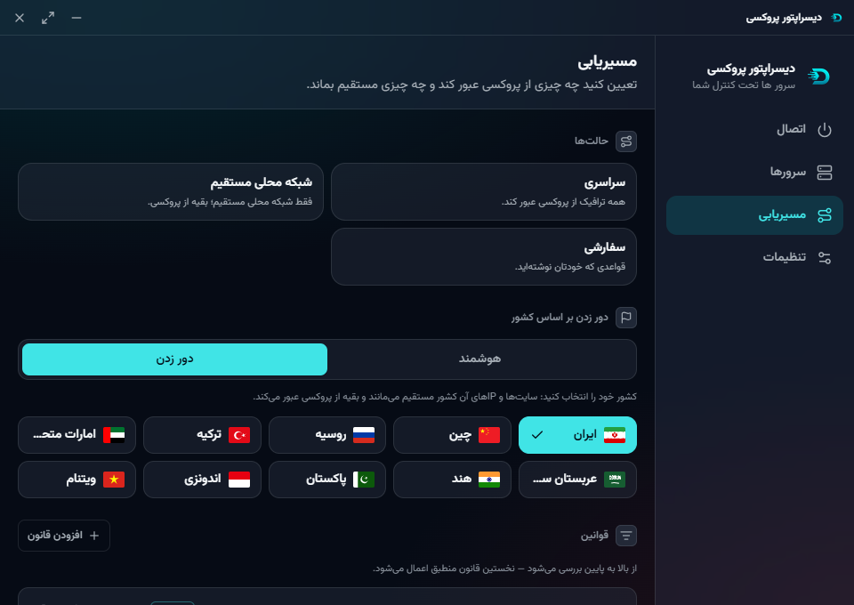

<p align="center">
  
</p>

<h1 align="center">DisruptorProxy/Core</h1>

<p align="center">
  Source of <strong>Disruptor Proxy</strong>, a proxy client for Windows, Linux, macOS, and Android built on
  <a href="https://github.com/XTLS/Xray-core">Xray-core</a>.
</p>

<p align="center">
  <a href="https://github.com/DisruptorProxy/Core/actions/workflows/ci.yml"></a>
  
  <a href="https://github.com/AzerothJS/AzerothJS"></a>
  
</p>

<p align="center">
  <a href="https://github.com/DisruptorProxy/Core/releases"><strong>Download a build</strong></a> &nbsp;&middot;&nbsp;
  <a href="https://github.com/DisruptorProxy/Wiki">Guides</a> &nbsp;&middot;&nbsp;
  <a href="#local-development">Build it yourself</a>
</p>

<p align="center">
  
</p>

<p align="center">
  
  &nbsp;
  
  &nbsp;
  
</p>

<p align="center">
  <em>Default window is 400x720; it expands to 960x680, where the tab bar becomes a side rail.<br />
  Same components, both layouts. Persian and Arabic mirror from logical CSS alone.</em>
</p>

## Stack

- **Frontend**: [AzerothJS](https://github.com/AzerothJS/AzerothJS) 2.0 (`.azeroth` components, fine-grained reactivity) + Tailwind CSS, bundled with Vite.
- **Shell**: [Tauri 2](https://tauri.app/) - a Rust-backed native window around the web frontend, roughly 10-20x smaller than an Electron equivalent.
- **Proxy core**: bundled `app-xray` ([Xray-core](https://github.com/XTLS/Xray-core)), driven via generated JSON configs and Tauri commands (`src-tauri/src/lib.rs`).
- **Storage**: IndexedDB for the server catalogue (`src/lib/db/`), scales to thousands of rows without a backend.
- **Languages**: 10, including Persian and Arabic. The layout mirrors from logical CSS properties alone, with no RTL overrides.

## Requirements

- **Node.js >= 24**
- The Rust toolchain, for anything that runs the desktop shell

## Local development

```sh
npm install
npm run tauri dev
```

`npm run dev` alone runs just the frontend in a browser on **http://localhost:1420**. Tauri-specific
APIs no-op outside the desktop shell - fine for UI work, not for anything touching the proxy engine,
geo files, the tray, or the updater.

## Configuration

Copy `.env.example` to `.env`. Every variable the frontend reads is listed there and typed in
`src/vite-env.d.ts`; keep the three in step.

| Key | Default | What it does |
| --- | --- | --- |
| `VITE_DEVTOOLS` | `true` | `'true'` installs the AzerothJS devtools panel in dev. Never in production. Append `?no-devtools` to the URL to skip it for one page load. |

Everything else - servers, routing, theme, language - is app state, not configuration, and lives in
IndexedDB and `localStorage`.

## Scripts

| Script | Does |
| --- | --- |
| `npm run dev` | AzerothJS dev server only (browser, no Tauri shell) |
| `npm run tauri dev` / `npm run desktop` | Full desktop app in dev mode |
| `npm run check` | `azeroth check` - typechecks **and** lints the whole frontend in one pass |
| `npm test` | The vitest suite over the parsers, the routing rules, and the Xray config builder |
| `npm run lint` / `npm run lint:fix` | ESLint on its own (including `.azeroth` files) |
| `npm run build` | Production frontend build |
| `npm run desktop-build` | Full production Tauri build (installer) |
| `npm run android` / `npm run android-apk` | Android dev on a device/emulator / assemble an APK |
| `npm run fetch-core [-- --target linux-64]` | Download + checksum-verify the Xray core for a target |
| `npm run tauri icon <path>` | Regenerate every platform icon from one square source image |
| `npm run release -- <version \| patch \| minor \| major>` | Bump the version, commit, tag, and push - see Releasing below |

## Project structure

```
src/                    frontend (.azeroth components, stores, lib)
  app/                   shell, router, nav, titlebar, tray
  pages/                 one file per route
  features/              feature-grouped components (configs, connection, subscriptions, routing, import)
  components/            shared UI primitives
  stores/                app state (createStore-based, one file per domain)
  lib/                    non-UI logic: db, search/filter, i18n, routing rules, xray config building
  workers/                the import parser, off the main thread
  assets/                 logo source files (see the icon script above)
tests/                  vitest specs over src/lib plus component fixtures
src-tauri/               Rust shell
  src/lib.rs              Tauri commands: xray process lifecycle, geo file downloads, config generation
  tauri.conf.json         app identity, window config, updater endpoint, bundle targets
  icons/                  generated by `tauri icon`; do not hand-edit
scripts/
  fetch-core.mjs          downloads and sha256-verifies the Xray core
  release.mjs             version bump + tag + push, see Releasing below
```

## Testing

```sh
npm test
```

The suite covers the code where being wrong is expensive and silent:

- **`src/lib/proxy/`** - every config link is untrusted input from a subscription URL, a paste, or a
  QR code. A malformed one must become a named failure, never a throw that takes the import down.
- **`src/lib/subs/`** - subscription format detection. Guessing wrong produces a silently empty
  import, the single most common complaint about every client in this category.
- **`src/lib/routing/`** - rule ORDER is the whole semantics. Xray takes the first match, so a
  `final` rule anywhere but last silently swallows everything after it.
- **`src/lib/xray/`** - the JSON the core boots from. A rule pointing at an outbound tag that does
  not exist makes the core reject the entire config, and the user sees "could not connect" with no
  reason given.

Component specs render through the real compiler against happy-dom via `@azerothjs/testing`.

## Production

```sh
npm run desktop-build
```

What that produces and what it depends on:

- **The proxy core is bundled, not downloaded at runtime.** `npm run fetch-core` pulls the official
  Xray-core release for a target and **verifies its sha256 against the release's own `.dgst`**
  before it is ever written into `src-tauri/assets`. The Windows core (`app-xray.exe` + `wintun.dll`)
  is committed; the unix and Android cores are fetched at build time.
- **Updates are signed.** The updater's public key lives in `tauri.conf.json` and the matching
  private key is a GitHub Actions secret (`TAURI_SIGNING_PRIVATE_KEY`), never committed. The client
  polls `latest.json` on this repo's latest release.
- **What is NOT built**: no MSI, and the macOS build is **unsigned and un-notarized** - code signing
  needs a paid Apple Developer account. iOS is scaffolded but not wired: it needs `tauri ios init`,
  a Packet Tunnel extension, and an xcframework core. See `docs/CROSS-PLATFORM.md`.
- CI proves the Linux, macOS and Windows bundles on every push to main, and assembles the Android
  APK best-effort. The signed public release is cut by the tag-triggered `release.yml`.

### Windows SmartScreen and antivirus

Windows Defender may flag a build as `Trojan:Win32/Bearfoos.B!ml` or similar. The `!ml` suffix
means a machine-learning heuristic fired, not that anything matched a known signature.

Nothing about that is surprising, and it is worth being straight about why. To a behavioural
classifier this app looks like a dropper: it is an **unsigned** binary that installs per-user, spawns
a bundled child executable (`app-xray.exe`), asks for elevation through the UAC `runas` verb, loads
a TUN driver (`wintun.dll`), and rewrites the system routing table. Every one of those is a real
thing the app does, and the combination is what a proxy client *is*.

The only durable fix is an **Authenticode code-signing certificate**, which this project does not
have yet. The minisign key in `tauri.conf.json` signs the *updater manifest* so the client will not
install a tampered update - it does nothing for SmartScreen or Defender, which are a different
trust system entirely. Until a certificate is in place:

- Verify the download against the checksums on the release, and build from source if you would
  rather not trust a binary at all.
- False positives can be reported to Microsoft at
  [the WDSI submission page](https://www.microsoft.com/en-us/wdsi/filesubmission).

An EV certificate clears SmartScreen immediately; an OV certificate accumulates reputation over
time. Neither is free, and neither should be worked around by other means.

## Releasing

Everything happens in this repo: it builds and signs the installer, and it is where users and the
auto-updater get it from.

```sh
npm run release -- patch     # or: minor, major, or an explicit X.Y.Z
npm run release -- patch --dry-run    # see every step first, changes nothing
```

1. Bumps `package.json`, `src-tauri/Cargo.toml`, and syncs `Cargo.lock`'s own entry; commits and
   tags (`vX.Y.Z`); pushes both.
2. The pushed tag triggers `.github/workflows/release.yml`: builds and signs, then publishes a
   **draft** release - the Windows installer + its `.sig`, the `.deb`, the `.apk`, and the
   `latest.json` the updater polls.
3. Review the draft on GitHub, then publish it manually. A draft is invisible to the updater and to
   anonymous downloads until you do.

## Security

Report a security bug privately rather than in a public issue - see [SECURITY.md](SECURITY.md).

The trust boundary, stated plainly:

- **Server credentials are user secrets held in plaintext.** Subscription URLs, UUIDs, passwords and
  host names live in IndexedDB with **no encryption at rest**. A key kept beside the ciphertext on
  the same disk protects nothing, and implying otherwise would be worse than being clear. Anyone
  with read access to the profile directory has the servers.
- **The proxy core runs as a child process** with a generated config on a loopback SOCKS port. It is
  the official upstream binary, checksum-verified at fetch time, not a fork.
- **Routing decides what leaves directly.** A rule change can send traffic outside the tunnel; that
  is the point of the feature, and it is why the routing screen shows the evaluated order rather
  than a toggle.

## Contributing

Issues and pull requests are welcome. For anything larger than a fix, open an issue first so the
approach can be agreed before you spend the time. See [CONTRIBUTING.md](CONTRIBUTING.md).

Both gates must pass:

```sh
npm run check
npm test
```

House style is enforced by the linter and visible in any neighbouring file: Allman braces, one
import per module, and comments that state a constraint the code cannot show rather than narrating
what changed.

## License

[MIT](LICENSE).
